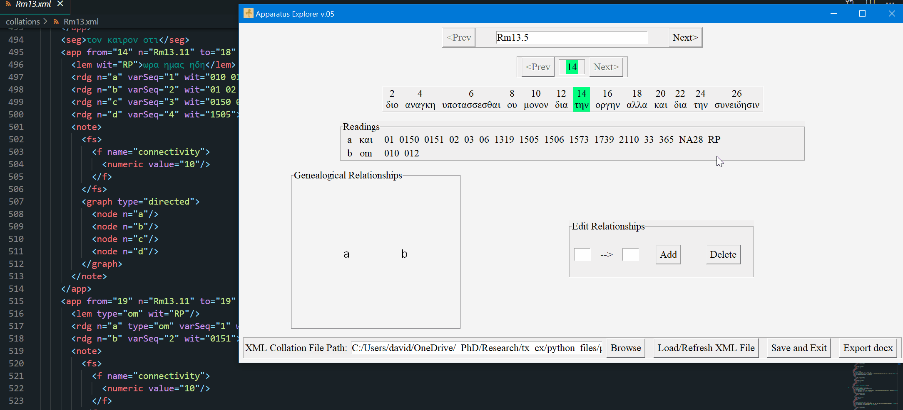
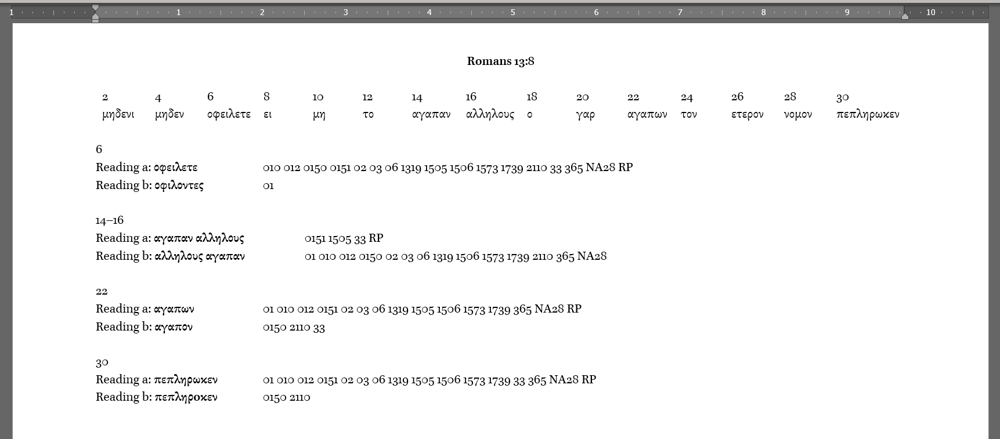

# Apparatus Explorer

This tool does does a few things:
* Visualization of a TEI XML encoded critical apparatus
* Conveniently adds edges to variation units
* Exports the XML apparatus to a formatted docx file
* Can make, display, and save local stemma graphs with GraphViz

This Apparatus Explorer was designed to prepare an XML collation file for use in Joey McCollum's open-cbgm library (https://github.com/jjmccollum/open-cbgm-standalone). The open-cbgm library allows for genealogical directions between variants to be encoded into the XML collation input file and utilized in various outputs. The Apparatus Explorer helps this process by presenting the user with the basetext, readings, witnesses, and the option to add and delete the relationships between variants (edges, or `<arc>` elements in the XML file).

Since this tool was developed for use in New Testament Textual Criticism, it can also export the critical apparatus as a formatted docx file for print and publication.

## Dependencies

Python 3.6+ is required in addition to the following libraries:
- `lxml` --mandatory
- `python-docx` --only needed when exporting to docx

[GraphViz](https://graphviz.org/) is optional. If GraphViz is installed and added to path, the Apparatus Explorer will display a PNG graph of the local stemma and save the graph to `/graphs`. If GraphViz is not installed, the Apparatus Explorer will display a plain text representation of the same data.

## Brief Tutorial
### XML Collation File
Presently, this will only work with a specifically prepared XML file:
1. Begin with the XML output from the Collation Editor from ITSEE at the University of Birmingham (https://github.com/itsee-birmingham/standalone_collation_editor).
    - The Collation Editor works best one verse at a time. This will produce many single-verse collation files. These should be combined into chapter and whole book collation files.
    - I have a few other Python scripts that automate this process; I plan to publish these as well.

2. Use Joey McCollum's itsee-to-open-cbgm python script to reformat the Collation Editor output (https://github.com/jjmccollum/itsee-to-open-cbgm).
3. Save the XML collation file to `/collations`

### Basetext
The Apparatus Explorer extracts the relevant verse from a basetext file for showing the context of witness readings. The basetext file should be the same as the one used with ITSEE's Collation Editor.

Basetext formatting:
1. The basetext file needs to be a plain text file `.txt`
2. One verse per line
3. SBL style reference at the beginning of every line. Examples:

`Rom 13:5 διο αναγκη υποτασσεσθαι ου μονον δια την οργην αλλα και δια την συνειδησιν`

`John 1:1 εν αρχη ην ο λογος και ο λογος ην προς τον θεον και θεος ην ο λογος`

3. The basetext file needs to have at least the same amount of content as the XML collation file.
4. The basetext file should be in `/files`

### Exporting to docx
The python-docx library can take a docx file and use its styling as a template. This template file should be named `template.docx` and stored in `/files`. The docx output will be saved to `/exported`.

### Included Examples
I have included an example collation file, an example basetext file, and a suitable docx template file. 

To test the tool using these examples, download or clone this repository.
- Windows: open `apparatus_explorer.exe`
- Any platform with Python 3.6+ installed: execute `apparatus_explorer.py`
1. Click 'Browse' and navigate to `Apparatus Explorer/collations` and open `R13.xml`. This will load a collation of Romans 13:5-14 that I edited.
    - The data for 01, 02, 03, and 33 are from the INTF NT.VMR TEI XML transcriptions (https://ntvmr.uni-muenster.de/manuscript-workspace). The data for 018, 0150, 0151, 1506, and 2110 are the result of my research. The rest of the data was taken from Reuben J. Swanson, _New Testament Greek Manuscripts: Variant Readings Arranged in Horizontal Lines against Codex Vaticanus: Romans_ (2001).
2. Click "Load/Refresh XML File. Navigate between different verses by either 1) using the top level 'Prev' and 'Next' buttons, or 2) typing in a reference into the top input field and then clicking "Load/Refresh XML File" to update the screen.
3. The XML file is automatically saved any time that an `<arc>` element is added or deleted using the "Edit Relationships" frame. It is still important to select "Save and Exit" before using the file with the open-cbgm. Loading the XML file into the Apparatus Explorer applies a few slight modifications that are restored when clicking "Save and Exit." The collation file will still load correctly into the Apparatus Explorer if this is forgotten, so it can be remedied any time prior to being processed by the open-cbgm library.