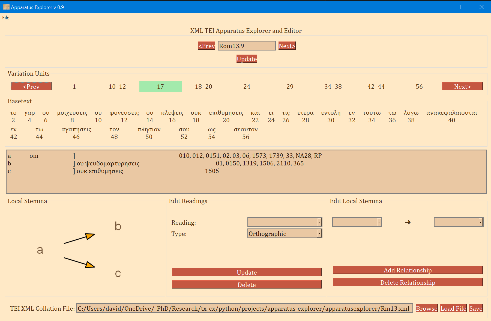

# Apparatus Explorer

This tool does does a few things:
* Visualization of a TEI XML encoded critical apparatus
* Facilitates adding edges to variation units and reading types.
* Can make, display, and save local stemma graphs with GraphViz

The Apparatus Explorer is primarily for conveniently viewing a digital apparatus with integrated local stemma graphs and preparing the apparatus file for use in the open-cbgm library (https://github.com/jjmccollum/open-cbgm-standalone).

The CBGM can only be fully utilized if the direction of relationship between each reading in a variation unit is encoded. This is what the Apparatus Explorer was made to help. It was (and is being) developed during my PhD studies to help with my broader project in New Testament Textual Criticism.

# Tutorial
## Installing
### Dependencies
#### **Windows Package**
For Windows users, only the MSI installer is necessary. The installer includes everything that is needed except for [GraphViz](https://graphviz.org/), which is recommended but optional. If GraphViz is installed and added to path, the Apparatus Explorer will display a PNG graph of the local stemma. If GraphViz is not installed, then the Apparatus Explorer will display a plain text representation of the same data.

The Apparatus Explorer was packaged with Briefcase from the Beeware Project (https://github.com/beeware/briefcase)

#### **Running from Source**
- Python 3.6+ should be okay, but it was developed in 3.8
- `lxml`
- `Pillow`
- `PySide2` - This is a large library. A 'lite' version is included with the MSI Windows installer.
- `PySimpleGUIQt` - This is an abstracted API for working with PySide2--it helped to significantly speed up development time (in addition to facilitating the use of colorful themes).
- [GraphViz](https://graphviz.org/) is optional but recommended.

To start the Apparatus Explorer on any platform* with the above dependencies in place: 
- Clone or download this repository
- Navigate to `apparatusexplorer/src`
- Run `python -m apparatusexplorer`

\* *NB*: The GUI needs significant tweaking for the proportions to look right on MacOS. It is not tested on Linus.

## Getting Started with the Apparatus Explorer

1. Begin with the XML output from the Collation Editor from ITSEE at the University of Birmingham (https://github.com/itsee-birmingham/standalone_collation_editor).
    - This presumes that transcriptions files have already been properly tokenized and encoded in JSON files, then collated with the Collation Editor. If you are unfamiliar with the Collation Editor, see "A Note About the Collation Editor" below.
    - The Collation Editor works best one verse at a time. This will produce many single-verse collation files. 
    - These should be combined into chapter and whole book collation files. The Apparatus Explorer can combine XML files, find this tool under File.

2. Launch the Apparatus Explorer (either by clicking on the shortcut after installing on Windows after installing with the MSI file or running from source as described above).

3. Click on "Browse" and navigate to the XML output file. An example XML file is included in this repository.

4. Click "Load". The Apparatus Explorer will check the file and see if it needs to be reformatted for use both in this application and in the open-cbgm. If the XML file needs to be converted, a reformatted copy will automatically be generated using Joey McCollum's itsee-to-open-cbgm utility (https://github.com/jjmccollum/itsee-to-open-cbgm) which has been included with the Apparatus Explorer. If successful, a new file will have been created and loaded. You will notice that `_reformatted.xml` is appended to the original file name.

5. Upon successfully loading the XML collation file, the first verse or other unit will be displayed. The basetext used during collation is reconstructed from `<seg>` and `<lem>` elements and displayed with an index number under every word.

6. From here one can begin to edit the local stemma for each variation unit and change the reading type attributes.

### Application Interface
- Use the "Prev" and "Next" buttons to either side of the Reference input at the top of the app to navigate to the next or previous verse.
- One can also navigate to a different verse by typing the reference into the upper input field and clicking "Update".
- The frame labeled "Variation Units" shows all of the variation units for the present verse. The each number (or range of numbers) in this frame identifies a variation unit. This index units were assigned during collation. The highlighted number (or number range) is the currently selected variation unit. Clicking "Prev" and "Next" in this frame navigates to the previous and next variation unit.
- The "Basetext" frame displays the basetext as reconstructed from the XML collation file. All words that correspond to the variation unit currently in focus will be highlighted as well.

- The next frame contains a lot of information that is generated from the XML file. From left to write, it displays the reading name or identifier, e.g. "a" or "b", etc, followed by the reading type. The Greek reading text is shown after a square bracket followed by all the witnesses which attest to this reading. There will normally be one reading per line, depending on the length of the reading and number of witnesses. All of the text in this frame is selectable; it can be copy and pasted for use elsewhere. The example image above shows that reading "br" is a "subr" (subreading) of reading "b" since it is a very minor spelling variation. Reading "c" is an omission. Not reading types have been assigned to readings "a" or "b", and none must be assigned.

- On the bottom left, a graph is generated showing the relationships of the readings of the variation unit currently in focus. If no direction has been encoded, the graph will simply display the reading identifiers. To use or save the graph, simply click on it and it will be opened by your computer's default photo or image viewer. From there you can save it for later use.
- The center-bottom frame is labeled "Edit Readings". It is for adding or changing the reading attribute. These attributes are helpful for filtering results in the open-cbgm and for future reference.
- The bottom-right "Edit Local Stemma" frame is for adding and deleting directions between readings. The graph on the bottom-left will update to reflect changes to the local stemma.
- The file being edited is shown on the bottom in addition to a "Save" button. This button will overwrite the loaded file with the new changes. to save a copy of the file, select "Save As" from the File menu on the top left.

- There are a few settings available in the File menu. Clicking "Settings" will open a popup window with a few options.
  - Graph orientation: The generated graphs can progress from left to right (horizontal) or top to bottom (vertical).
  - Graph Background Color: If transparent, the graph can be saved and added to any document and only the text and lines will be visible.
  - Color Theme: There are currently four color themes. I recommend "Parchment" or "Dark Mode", both themes that I designed with my own eyes in mind.
  - DPI Awareness is to fix scaling problems that can occur on high resolution Windows computers. It should not need to be changed, but if the app looks blurry, experiment with the options.
  - Note that the application must be restarted for themes or DPI awareness changes to take effect.

### A Note About the Collation Editor
The easiest way to prepare transcription files in a compatible format is to either:
  1. Use [TranscriptEdit](https://github.com/d-flood/transcribedit) to transcribe the witness. TranscriptEdit allows the user to transcribe in plain text and immediately add any desired transcription encodings such as corrections and lacunae. The file is then saved as a JSON file, no conversion necessary. Since TranscriptEdit was developed specifically for preparing transcriptions for the Collation Editor, it works one verse (or other collation unit) at a time. This simplifies some things, but it will be a major drawback for some. Since page, column, and line breaks can be encoded with TranscriptEdit, a future goal is to add support for exporting the transcription in its exact page layout to a docx file. Essentially, this feature will be added as soon as I need it for sharing my own research.
  2. Transcribe in plain text and use [Tendon](https://github.com/d-flood/Tendon) to tokenize the transcription and save it as JSON files. In my current workflow, Tendon is deprecated and I will eventually publish its replacement. The conversion from XML TEI encoded transcription files to the tokenized JSON input files required for the Collation Editor is difficult. Errors in the transcription _will_ result. This is true of Tendon's XML to JSON tool, and it is true of the tool used to create the JSON transcription files on the INTF NT.VMR (see [here](https://ntvmr.uni-muenster.de/community/vmr/api/transcript/get/?docID=20001&indexContent=Matt%20inscriptio;%20Matt%201:1-25;%20Matt%202:1-5&pageID=40&format=wce) for an example). In short, a general purpose and reliable conversion tool does not exist for transforming TEI XML transcriptions encoded using the ITSEE [Online Transcription Editor](https://itsee-wce.birmingham.ac.uk/ote/transcriptiontool). Tokenization of plain text transcription files is trivial and Tendon works very well for this. However, this means that _only_ the text of the transcription is encoded in the JSON file and not desirable encodings such as corrections and gaps.